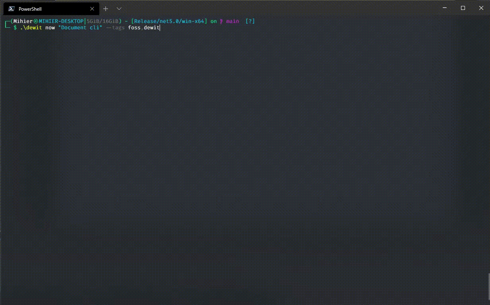

# dewit

**dewit** is a simple CLI application for you to track what you're working on.



## Getting Started

1. Download the binary from the [Releases page](https://github.com/Mihier-Roy/dewit/releases/latest).
2. Extract the files to a folder of your choice.
3. (Optional) Add the folder to your PATH so that you have access to the executable at all times.
4. If 3 has not been done, navigate to the folder with the extracted files and run the application!

## Usage

```
dewit [command] [arguments] [options]
```

`dewit` is organized into a set of sub-commands for each action. The commands available are listed below, but can always be found by running `dewit -h`.

```
Commands:
  now <title> 	- Adds a new task and sets it's status to 'Doing'.
  later <title> - Adds a new task and sets it's status to 'Later'.
  done <id>     - Set's a tasks status to 'Done'.
  edit <id>     - Edit the title and tags of a task.
  list          - List tasks entered.
  delete <id>   - Delete a particular task.
  export        - Export tasks to a CSV or JSON file.
  import <path> - Import tasks from a CSV or JSON file.
```

### Adding and completing tasks

-   You may add a task using the commands : `dewit now` or `dewit later`.

    ```
    dewit [now|later] "New task" --tags tag1,tag2,tag_3
    ```

-   You can complete a task using the `dewit done` command.

    ```
    dewit done <task-ID>
    ```

### Editing a task

`dewit edit` allows you to edit the title and tags of a task. It accepts the following options which may be used independently or in combination.

-   Edit the title of a task

    ```
    dewit edit <task-ID> --title "New title"
    ```

-   Add/Remove Tags

    ```
    dewit edit <task-ID> --add-tags new_tag --remove-tags old_tag
    ```

-   Reset Tags (remove all tags associated with a task)

    ```
    dewit edit <task-ID> --reset-tags
    ```

### Displaying tasks

The `list` command is used to display tasks. By default, it will display only the tasks that have been created on the same day. The list command accepts a range of options which allow you to sort and filter the tasks displayed. The options listed below may be used individually or combined together to retrieve a specific list of tasks.

-   The `--duration` option accepts the following values : `all|month|today|week|yesterday`.

    ```
    dewit list --duration week
    ```

-   The list of tasks can be filtered by the `--status` option, which accepts the follwoing values : `doing|done|later`.

    ```
    dewit list --status later
    ```

-   Tasks may also be filtered based on tags using the `--tags` option, where you can specify the tags you wish to search for.

    ```
    dewit list --tags tag1
    ```

-   You may sort the returned values using the `--sort` option which allows you to sort by **date** or **status**.

    ```
    dewit list --sort date
    ```

-   If you want to search for tasks with particular word(s), you can do so using the `--search` tag.

    ```
    dewit list --search "Search expression"
    ```

### Tags

Tags can be added to a task by specifying all the tags in a comma-separated manner. Only alpha-numeric characters along with the underscore character are acccepted as tag names.
Example: `--tags tag1,tag2,tag_3`

### Import/Export

`dewit` supports exporting all saved tasks to a CSV or JSON file so that users may view the data in an easily portable and editable format. Users may also use the `import` command to import data. The import command appends all the tasks in a file to the existing list of tasks.

## Development

Getting setup to build the project should be relatively straight-forward. The following steps will guide you through the process:

1. Clone the repository
    ```bash
    git clone https://github.com/Mihier-Roy/dewit
    ```
2. Navigate to the source directory and restore dependencies
    ```bash
    cd dewit/src
    dotnet restore
    ```
3. Build and run the application
    ```bash
    dotnet run --project Dewit.CLI -- now "New task" --tags some,tags,here
    ```

### Dependencies/Libraries Used

-   [System.CommandLine](https://github.com/dotnet/command-line-api)
-   [EntityFramework Core + SQLite](https://github.com/dotnet/efcore)
-   [CsvHelper](https://github.com/JoshClose/CsvHelper)
-   [Serilog](https://github.com/serilog/serilog)
-   [Spectre.Console](https://github.com/spectresystems/spectre.console)

## Contribute

`dewit` was developed using C# and .NET5, mostly as a way for me to get familiar with using the `System.CommandLine` NuGet library to build command line applications.

Feel free to contribute any new features or fixes by submitting a PR or creating an Issue.

## License

-   see [LICENSE](https://github.com/username/sw-name/blob/master/LICENSE.md) file
